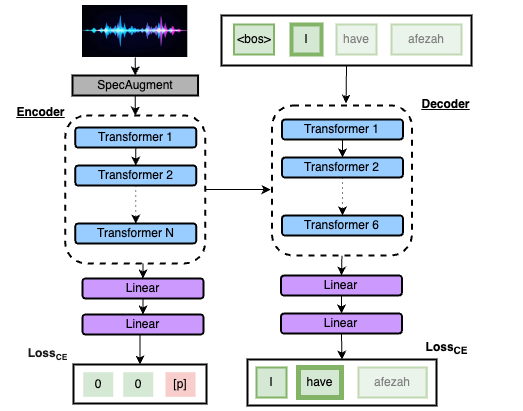
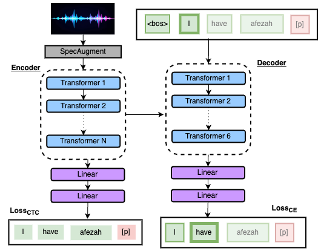

# Introduction
We present one of the first works in E2E multiclass paraphasia classification (phonemic, neologistic, semantic) on continuous speech using the ApahsiaBank corpus. In this work we explore two seq2seq methods.
1. Multi-seq: The decoder has two classification heads (one for ASR and the other for paraphasia classification) that produce temporally aligned sequences.
2. Single-seq: The decoder has a single classification head that is responsible for outputting both ASR and paraphasia classification labels in a single sequence. This model learns to predict a given paraphasia label after a paraphasic word.
We compare our work against a baseline approach which uses a seq2seq ASR and ChatGPT-4 in order to classify paraphasias from the transcriptions.
<!-- For more details, please refer to our [paper](https://arxiv.org/abs/2312.10518). -->

# Model Architecture
## Multi-seq Model

## Single-seq Model

# Example Output
\[
\begin{array}{|l|c|c|}
\hline
\textbf{Model} & \textbf{Example 1} & \textbf{Example 2} \\
\hline
\text{Intended} & \text{VAST is easy to use} & \text{the southern united states} \\
\hline
\text{Ground Truth} & \text{felma [n]  is  easy  to  lose [p]} & \text{the southern anuastat [n]} \\
\hline
\text{ASR + GPT} & \text{tedami is easy to choose} & \text{the sathern [n] and you state} \\
\hline
\text{Single-Seq} & \text{fella [p]  is  easy  to   uz [p]} & \text{the southern and the stat [p]} \\
\hline
\text{Multi-Seq} & \text{fami [n] is easy [p] to use [p]} & \text{the southern and the stat} \\
\hline
\end{array}
\]

# Setup
This repo is built with the **[SpeechBrain Toolkit](https://github.com/speechbrain/speechbrain)** , please refer to their repo for download and installation first.

# Instructions
## Pretraining on Protocol dataset

## Finetuning on Scripts dataset

##  Multi-seq model:
1. Edit the yaml config file `AphasiaBank/hparams/Scripts/seq2seq.yaml`
2. Run using `python SB_run_experiment.py AphasiaBank/hparams/Scripts/seq2seq.yaml`

##  ASR-only Models:
1. Check out the yaml files in `AphasiaBank/hparams/ASR`
2. run using the scripts in `AphasiaBank/ASR`

# Citing
If you found this work helpful, please cite using the following bibtex entry:

# UNDER CONSTRUCTION
More details to come...

